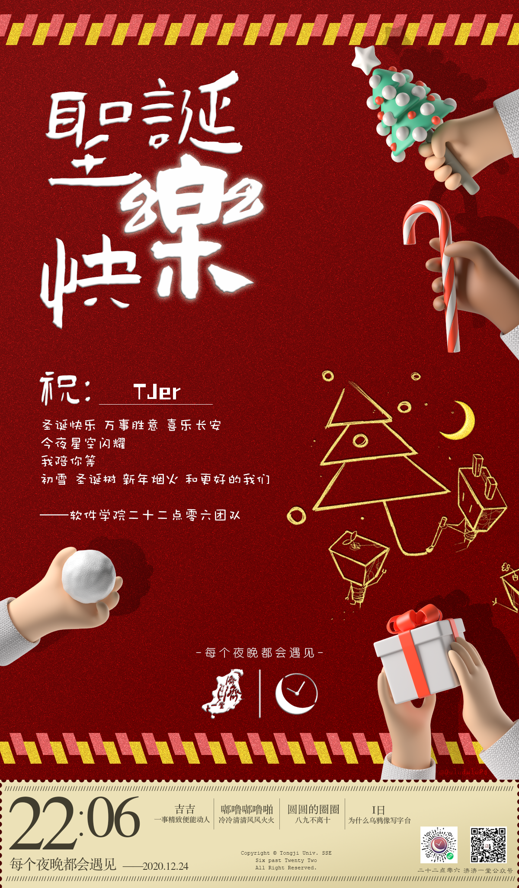

# 一封来自同济圣诞老人的贺卡

🎄Christmas Card for TJer (Designed &amp; Powered by Six-past-TwentyTwo)

-----

<div align="left" display="inline-block">
㊗️TJer：<br/>
&nbsp;&nbsp;&nbsp;&nbsp;圣诞快乐 万事胜意 喜乐长安<br/>
&nbsp;&nbsp;&nbsp;&nbsp;今夜星空闪烁<br/>
&nbsp;&nbsp;&nbsp;&nbsp;我陪你等<br/>
&nbsp;&nbsp;&nbsp;&nbsp;初雪❄️ 圣诞树🎄 新年烟火🎆 和更好的我们<br/>
&nbsp;&nbsp;&nbsp;&nbsp;&nbsp;&nbsp;&nbsp;&nbsp;—— 软件学院二十二点零六团队
</div>
<br/>

<div align="center">
  
  
  
</div>


<br/>

<details>
	<summary>For Developers⬇️</summary>

## 写在前面

> 这里是项目的背景和一些引入intro


<br/>

## 主要功能

- [x] xxx


<br/>

## 如何使用

1. xxx


<br/>

### TODOs

> 还没有做的尽善尽美的东西
>
> 还可以做的更好的

- [ ] yyy


<br/>

## 目录结构
```
.
├── README.md
├── christmas-card
│   ├── Christmas-Card-for-TJUer-glod.PNG
│   ├── Christmas-Card-for-TJUer-green.PNG
│   ├── Christmas-Card-for-TJUer-public.PNG
│   └── Christmas-Card-for-TJUer-red.PNG
├── resource
│   ├── ava.jpg
│   ├── card.png
│   ├── lvse.png
│   └── 仓耳小丸子.ttf
└── src
    ├── gen_card.py
    ├── login_163.py
    └── post_email.py
```

</details>

<br/>

## 关于我们

|  姓名  |        学院         |        分工       |                             头像                             |
| :----------: | :-----------------: | :--------------------------: | :----------------------------------------------------------: |
|  张喆  |    软件学院 17级    | 项目发起人、PM |  |
| 陈开昕 |    软件学院 17级    | 美术 |  |
| 陈中悦 |    软件学院 19级    | 代码实现 |  |
| 傅薏帆 | 新生院济勤学堂 20级 | 文案 |  |

<br/>

<div align="center">
Copyright© Tongji Univ. SSE<br/>
Six past Twenty Two<br/>
All Right Reserved.<br/>
</div>
